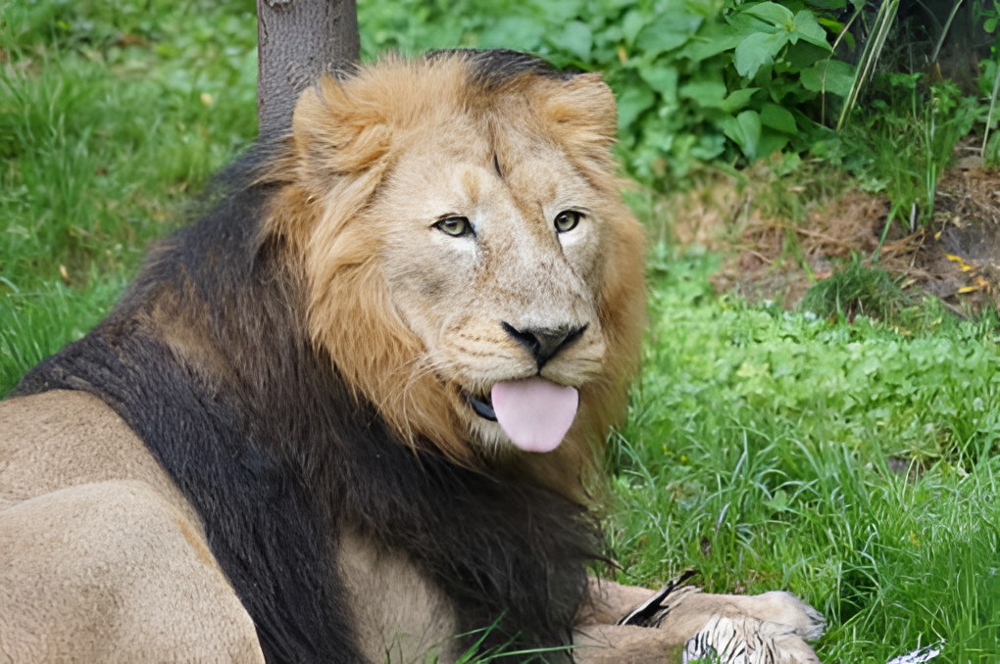

Super Resolution with Generative Adversarial Networks
The Task is Super Resolution using Generative adversarial networks using pytorch. 

## Table of Contents
- [Introduction](#introduction)
- [Model Overview](#ModelOverview)
- [Results](#Results)

# Introduction
Super Resolution with GANs using PyTorch
Welcome to the Super Resolution GitHub repository! This project focuses on enhancing the resolution of images using Generative Adversarial Networks (GANs) implemented in PyTorch. Specifically, we utilize RealESRGAN with scale factors of 2, 4, and 8 to take images with low resolution as input and produce high-resolution outputs.

# Model Overview

RealESRGAN is an enhanced version of ESRGAN (Enhanced Super-Resolution Generative Adversarial Networks). It incorporates the RRDBNet architecture and is trained specifically for super-resolution tasks. RealESRGAN achieves state-of-the-art performance in generating high-quality, realistic images with enhanced details and sharpness.

The RealESRGAN class in the implementation provides functionalities for loading pre-trained RealESRGAN models and performing super-resolution inference on input images. It leverages the RRDBNet architecture to process low-resolution images and generate corresponding high-resolution outputs.

These components collectively enable efficient and effective super-resolution capabilities, facilitating various applications in image enhancement and processin

The Link to the using weights on the <a href="https://drive.google.com/drive/folders/1vHJHxXYuCjsRReZHi_b1LP5kRYv7s9fd?usp=sharing" target="blank">Drive</a>.

# Results

